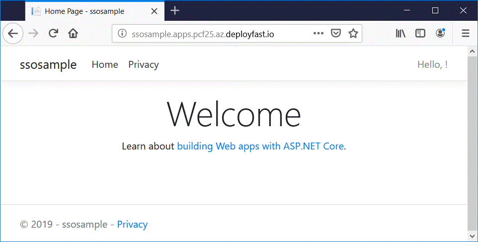
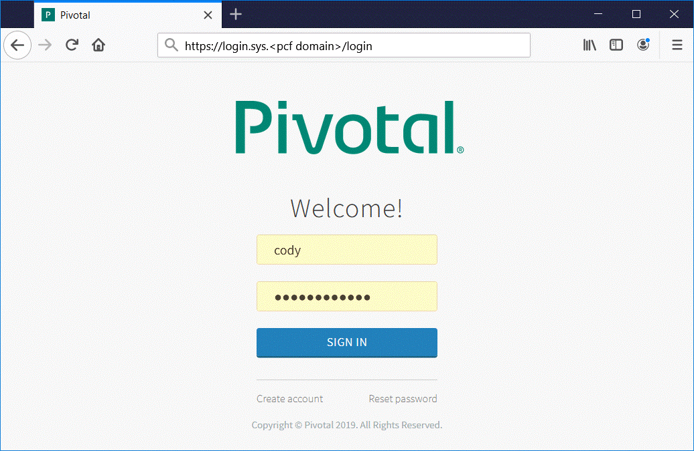
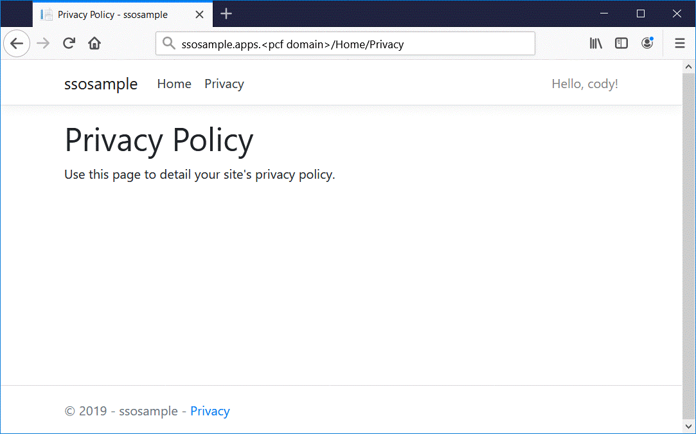
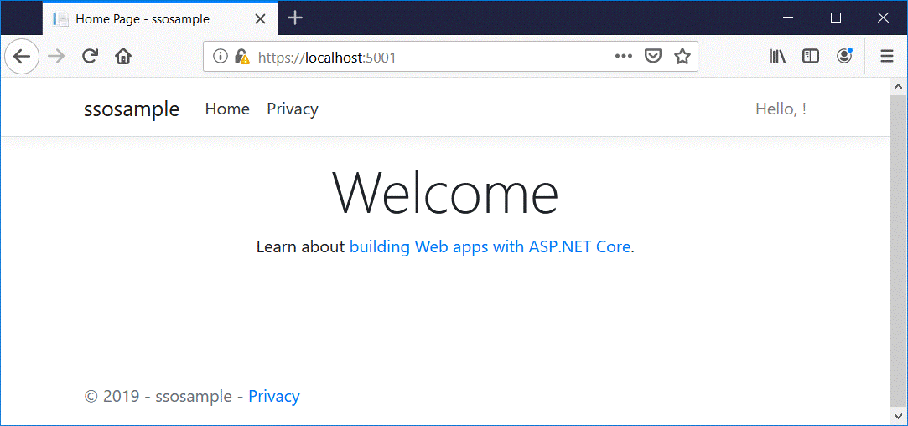
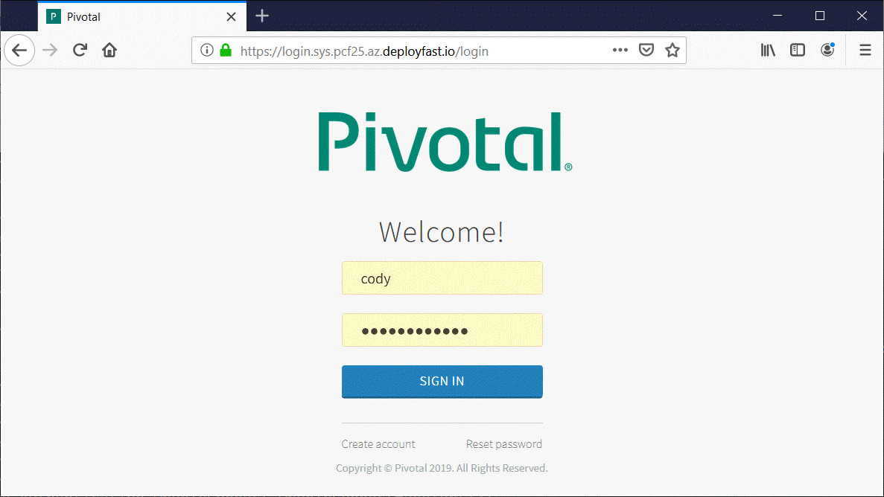
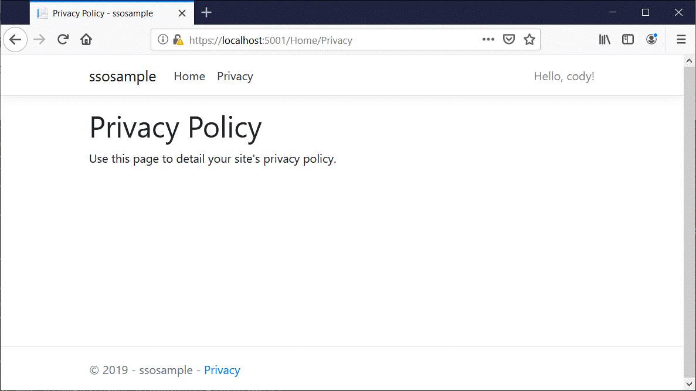

# Single Sign-on with OpenID Connect

This tutorial takes you through setting up a .NET Core web application that uses single sign-on (SSO) with an OpenID connect provider.

## Pre-requisites

A PCF foundation running [Single Sign-On on for PCF](https://network.pivotal.io/products/pivotal_single_sign-on_service/) is required to complete this tutorial.

## Start a SSO service instance

Create an SSO service instance for use in local development and on cloud foundry.

Create the service instance in the target org and space you will use for development.

`cf create-service p-identity uaa uaa-sso`

 (!) If the uaa service plan is not available, an admin can use the following command to enable it.

`cf enable-service-access p-identity -p uaa`

## Create the .Net core application
```
dotnet new mvc --auth Windows --name ssosample
cd ssosample
dotnet add package Steeltoe.Extensions.Configuration.CloudFoundryCore --version 2.3.0
dotnet add package Steeltoe.Security.Authentication.CloudFoundryCore --version 2.3.0
```
## Modify Program.cs 

Make the bold changes to the Program.cs file.

---

using System;

using System.Collections.Generic;

using System.IO;

using System.Linq;

using System.Threading.Tasks;

using Microsoft.AspNetCore;

using Microsoft.AspNetCore.Hosting;

using Microsoft.Extensions.Configuration;

using Microsoft.Extensions.Logging;

**using Steeltoe.Extensions.Configuration.CloudFoundry;**

 

namespace ssosample

{

​        public class Program

​        {

​        public static void Main(string[] args)

​        {

​               CreateWebHostBuilder(args).Build().Run();

​        }

 

​        public static IWebHostBuilder CreateWebHostBuilder(string[] args) =>

​            WebHost.CreateDefaultBuilder(args)

​               **.UseCloudFoundryHosting()**

​               **.AddCloudFoundry()**

​               .UseStartup<Startup>();

​        }

}

## Modify Startup.cs 

Make the boldchanges to the Startup.cs file.

 

using System;

using System.Collections.Generic;

using System.Linq;

using System.Threading.Tasks;

using Microsoft.AspNetCore.Builder;

using Microsoft.AspNetCore.Hosting;

using Microsoft.AspNetCore.Http;

using Microsoft.AspNetCore.HttpsPolicy;

using Microsoft.AspNetCore.Mvc;

using Microsoft.Extensions.Configuration;

using Microsoft.Extensions.DependencyInjection;

**using Microsoft.AspNetCore.Authentication.Cookies;**

**using Microsoft.AspNetCore.HttpOverrides;**

**using Steeltoe.Security.Authentication.CloudFoundry;**

 

namespace ssosample

{

​    public class Startup

​    {

​        public Startup(IConfiguration configuration)

​        {

​            Configuration = configuration;

​        }

 

​        public IConfiguration Configuration { get; }

 

​        // This method gets called by the runtime. Use this method to add services to the   

​        // container.

​        public void ConfigureServices(IServiceCollection services)

​        {

​            services.Configure<CookiePolicyOptions>(options =>

​            {

​                // This lambda determines whether user consent for non-essential cookies is 

​                // needed for a given request.

​                options.CheckConsentNeeded = context => true;

​                options.MinimumSameSitePolicy = SameSiteMode.None;

​            });

​                       

​            **services.AddAuthentication((options) =>**

​            **{**

​                **options.DefaultScheme = CookieAuthenticationDefaults.AuthenticationScheme;**

​                **options.DefaultChallengeScheme = CloudFoundryDefaults.AuthenticationScheme;**

​            **})**

​            **.AddCookie()**

​            **.AddCloudFoundryOpenIdConnect(Configuration);**

 

​            services.AddMvc().SetCompatibilityVersion(CompatibilityVersion.Version_2_2);

​        }

 

​        

​        // This method gets called by the runtime. Use this method to configure the HTTP request 

​        //pipeline.

​        public void Configure(IApplicationBuilder app, IHostingEnvironment env)

​        {

​            if (env.IsDevelopment())

​            {

​                app.UseDeveloperExceptionPage();

​            }

​            else

​            {

​                app.UseExceptionHandler("/Home/Error");

​                // The default HSTS value is 30 days. You may want to change this for production 

​                // scenarios, see https://aka.ms/aspnetcore-hsts.

​                app.UseHsts();

​            }

 

​            app.UseHttpsRedirection();

​            app.UseStaticFiles();

​            **//app.UseCookiePolicy(); <-- comment out;** 

 

​            **app.UseForwardedHeaders(new ForwardedHeadersOptions**

​            **{**

​                **ForwardedHeaders = ForwardedHeaders.XForwardedProto**

​            **});**

 

​    **app.UseAuthentication();**

 

​            app.UseMvc(routes =>

​            {

​                routes.MapRoute(

​                    name: "default",

​                    template: "{controller=Home}/{action=Index}/{id?}");

​            });

​        }

​    }

}

## Modify HomeController.cs 

Make the bold changes to the HomeController.cs file.

 

using System;

using System.Collections.Generic;

using System.Diagnostics;

using System.Linq;

using System.Threading.Tasks;

using Microsoft.AspNetCore.Mvc;

using ssosample.Models;

**using Microsoft.AspNetCore.Authorization;**

 

namespace ssosample.Controllers

{

​    public class HomeController : Controller

​    {

​        public IActionResult Index()

​        {

​            return View();

​        }

 

​        **[Authorize]**

​        public IActionResult Privacy()

​        {

​            return View();

​        }

 

​        [ResponseCache(Duration = 0, Location = ResponseCacheLocation.None, NoStore = true)]

​        public IActionResult Error()

​        {

​            return View(new ErrorViewModel { RequestId = Activity.Current?.Id ?? 

​                HttpContext.TraceIdentifier });

​        }

​    }

}

## Modify appsettings.json 

Make the bold changes to the appsettings.json file.

 

{

  "Logging": {

​    "LogLevel": {

​      "Default": "Warning"

​    }

  },

  "AllowedHosts": "*",

  "security": {

​    "oauth2": {

​      "client": {

​        "validateCertificates": false

​      }

​    }

  }

}


##  

## Create manifest.yml 

Create a file called manifest.yml with the following content. Replace <pcf domain> with your PCF foundation domain.

 

applications:

\- name: ssosample

  disk_quota: 1G

  instances: 1

  memory: 1G

  routes:

  \- route: ssosample.apps.<pcf domain>

  stack: cflinuxfs3

  command: cd ${HOME} && exec dotnet ./ssosample.dll --server.urls http://0.0.0.0:${PORT}

  services:

​    \- uaa-sso

  env:

​    \# Whitelist of redirect URI(s) allowed for the application. This value must start with http:// or https://

​    SSO_REDIRECT_URIS: http://ssosample.apps.<pcf domain>/**,https://ssosample.apps.<pcf domain>/**,https://localhost:5001/**

## Modify ssosample.csproj 

Make the highlighted changes to the ssosample.csproj file.

 

<Project Sdk="Microsoft.NET.Sdk.Web">

 

  <PropertyGroup>

​    <TargetFramework>netcoreapp2.2</TargetFramework>

​    <AspNetCoreHostingModel>InProcess</AspNetCoreHostingModel>

  </PropertyGroup>

 

 

  <ItemGroup>

​    <PackageReference Include="Microsoft.AspNetCore.App" />

​    <PackageReference Include="Microsoft.AspNetCore.Razor.Design" Version="2.2.0" PrivateAssets="All" />

​    <PackageReference Include="Steeltoe.Extensions.Configuration.CloudFoundryCore" Version="2.3.0" />

​    <PackageReference Include="Steeltoe.Security.Authentication.CloudFoundryCore" Version="2.3.0" />

  </ItemGroup>

 

  **<ItemGroup>**

​    **<None Update="manifest.yml">**

​      **<CopyToOutputDirectory>Always</CopyToOutputDirectory>**

​    **</None>**

  **</ItemGroup>**

 

</Project>

## Publish the application

Publish the .Net core application from the project directory (e.g. ssosamle).

`dotnet publish -c Release`

## Push the application to PCF

Change directory to the publish folder and push the application to PCF

```
cd bin\Release\netcoreapp2.2\publish
cf push
```

## Test SSO on PCF

Open the published website in a browser: http://ssosample.apps.<pcf domain> 


Notice that in the upper right hand corner, “Hello, !”.


Now, click on the “Privacy” tab. You will be redirected to the login page.



 

Enter your credentials and click “SIGN IN”. You will be redirected to the privacy page. 



Notice that in the upper right hand corner, “Hello, cody!”. You have been authenticated and granted access to the “Privacy” page. Success!

## Configure SSO for local development

Now that you have SSO configured and running on PCF, you can configure your local environment to use PCF SSO locally as well.

 

Show the environment variables for the ssosample application.

`cf env ssosample`

 

Locate the following section in the output. Note the highlighted environment pairs. Your values will be different. Replace <pcf domain> with your PCF foundation domain.

 

{

 "VCAP_SERVICES": {

  "p-identity": [

   {

​    "binding_name": null,

​    "credentials": {

​     "auth_domain": "https://login.sys.<pcf domain>",

​     "client_id": "40cc0be8-2790-4e65-b4aa-5913efdc9e95",

​     "client_secret": "5e1b7e38-65bd-4cbc-997e-e0ecf89afea0",

​     "grant_types": [

​      "authorization_code"

​     ]

​    },

​    "instance_name": "uaa-sso",

​    "label": "p-identity",

​    "name": "uaa-sso",

​    "plan": "uaa",

​    "provider": null,

​    "syslog_drain_url": null,

​    "tags": [],

​    "volume_mounts": []

   }

  ]

 }

}

 

Copy the three values highlighted above and add them to the appsettings.json file as follows. Note that the key names are slightly different. You 

{

  "Logging": {

​    "LogLevel": {

​      "Default": "Warning"

​    }

  },

  "AllowedHosts": "*",

  "security": {

​    "oauth2": {

​      "client": {

​        "authority": "https://login.sys.<pcf domain>",

​        "clientId": "40cc0be8-2790-4e65-b4aa-5913efdc9e95",

​        "clientSecret": "5e1b7e38-65bd-4cbc-997e-e0ecf89afea0",

​        "validateCertificates": false

​      }

​    }

  }

}

## Test SSO locally

Make sure you are in the directory with your .csproj file. If you are still in the publish folder you will need to navigate up four levels.

`cd ..\..\..\..`

Run ssosample.

` dotnet run `

 

Open ssosample in a browser using the url output from the run command: https://localhost:5001



Notice that in the upper right hand corner, “Hello, !”.

 

Now, click on the “Privacy” tab. You will be redirected to the login page.


Enter your credentials and click “SIGN IN”. You will be redirected to the privacy page. 

 



Notice that in the upper right hand corner, “Hello, cody!”. You have been authenticated and granted access to the “Privacy” page. Success!
